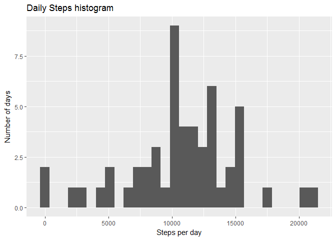
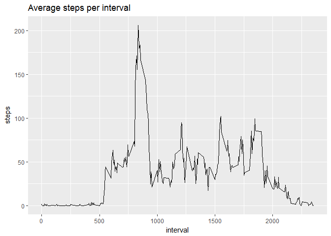
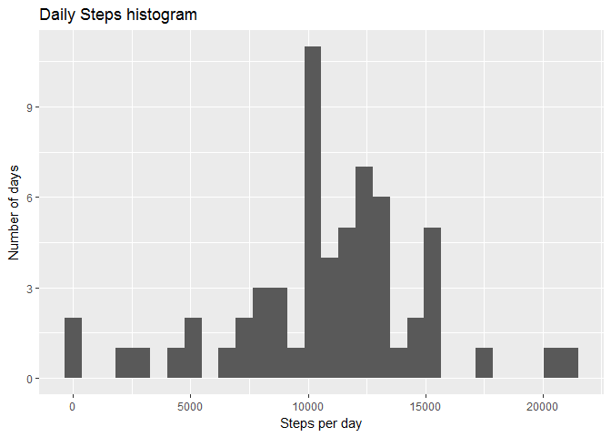
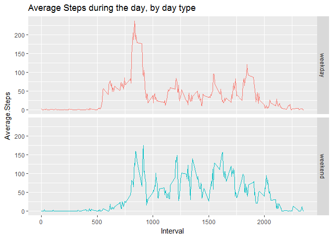

# Reproducible Research: Peer Assessment 1
Rene Marves  
8 de abril de 2017  


## Loading and preprocessing the data
First, the data table is loaded directly from the zip file.  Then the date column is converted to a date field.


```r
# List of packages for session
.packages = c("ggplot2", "lubridate", "dplyr")
# using lubridate to avoid regional settings issues with language

# Install CRAN packages (if not already installed)
.inst <- .packages %in% installed.packages()
if(length(.packages[!.inst]) > 0) install.packages(.packages[!.inst])

# Load packages into session 
lapply(.packages, require, character.only=TRUE)

# read data, convert data to date and add weekdays
dt <- read.csv(unz("activity.zip", "activity.csv"), header=T, quote="\"", sep=",")
dt$date <- as.Date(as.character(dt$date), "%Y-%m-%d")
dt$weekday <- wday(dt$date, label = TRUE, abbr = FALSE) # adds weekday to the dataframe
```


## What is mean total number of steps taken per day?

Here we calculate the average steps per day in an aggregate data set, using the date as the aggretation field.


```r
dailysteps <- aggregate(steps ~ date, data = dt, FUN = sum)
qplot(dailysteps$steps, main = "Daily Steps histogram") +
  scale_y_continuous("Number of days") + 
  scale_x_continuous("Steps per day")
```

```
## `stat_bin()` using `bins = 30`. Pick better value with `binwidth`.
```

<!-- -->

```r
steps_summary <- summary(dailysteps$steps)
```

**Summary:**

**Mean** steps per day: 10770.

**Median** steps per day: 10760.


## What is the average daily activity pattern?

Now we aggregate in a similar fashion as before, but using the interval as the agregation field.


```r
avgint <- aggregate(steps ~ interval, data = dt, FUN = mean)
qplot(interval, steps, data = avgint, geom = "line", main = "Average steps per interval")
```

<!-- -->

```r
maxint <- avgint[avgint$steps == max(avgint$steps), ]$interval
```

The interval with the highest average steps in it is interval number 835.

## Imputing missing values

Quantifying and filling in for missing values.  Missing values will be completed using the average of the rounded interval average for the corresponding weekday of the missing value.


```r
nacount <- sum(is.na(dt))

# copy dataset
cdt <- dt

# for each NA for number of steps in the dataset 
for(i in which(is.na(cdt$steps))) {
    # get the mean value for that interval
    avgstep <- round(mean(dt[dt$interval == cdt$interval[i] & dt$weekday == cdt$weekday[i], ]$steps, na.rm = TRUE))
    # replace the NA with the value
    cdt$steps[i] <- avgstep
}
# clean excess variables
rm(list=c("i", "avgstep"))
```

There are 2304 missing values.

After filling in for missing values, this is the new data summary:

```r
dailysteps2 <- aggregate(steps ~ date, data = cdt, FUN = sum)
qplot(dailysteps2$steps, main = "Daily Steps histogram") +
  scale_y_continuous("Number of days") + 
  scale_x_continuous("Steps per day")
```

```
## `stat_bin()` using `bins = 30`. Pick better value with `binwidth`.
```

<!-- -->

```r
steps_summary2 <- summary(dailysteps2$steps)
```

**Summary:**

**Mean** steps per day: 10820.

**Median** steps per day: 11020.

## Are there differences in activity patterns between weekdays and weekends?

First we tag each data point as either weekday or weekend in another field, then we graph the result.


```r
cdt$daytype <- ifelse(((cdt$weekday == "Sunday") | (cdt$weekday == "Saturday")),"weekend","weekday")

wdt <- cdt %>%
    group_by(daytype, interval) %>%
    summarise(Average.Steps = mean(steps, na.rm = TRUE))


qplot(interval, Average.Steps, data = wdt, facets = daytype~., color=daytype, geom="line", main = "Average Steps during the day, by day type") +
  scale_x_continuous("Interval") +
  theme(legend.position = "none")
```

<!-- -->

